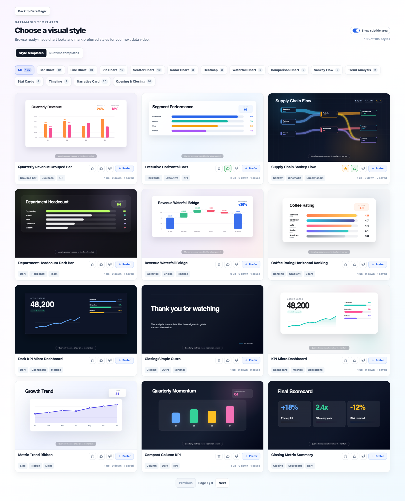
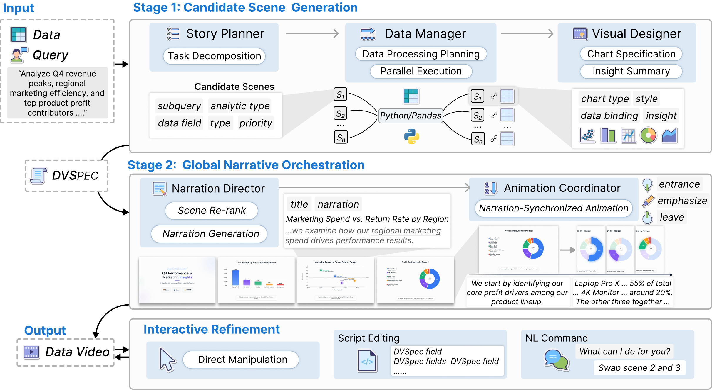

<div align="center">


**Turn structured data into narrated, animated data stories.**

*For analysts, researchers, and anyone who wants their data to tell a story.*

[](https://vldb.org/2026/)
[](https://arxiv.org/abs/2606.20388)
[](https://github.com/HKUSTDial/DataMagic/actions/workflows/docs.yml)


[中文](./README.md) | [English](./README.en.md)

[🔥 News](#-news) • [⚡ Quick Start](#-quick-start) • [🌟 Examples](#-examples) • [🎯 Workflows](#-workflows) • [📖 Citation](#-citation) • [🤝 Community](#-community)
</div>

## Links

**Try it:** [https://datamagic.chat/](https://datamagic.chat/)

**Project homepage:** [https://datamagic-home.github.io](https://datamagic-home.github.io)

**Paper:** [DataMagic: Transforming Tabular Data into Data Insight Video](https://arxiv.org/abs/2606.20388)

## 🔥 News

- **[2026.06.20]** 🚀 DataMagic is now live! Try it at [datamagic.chat](https://datamagic.chat/) — upload your data and generate a narrated data video in minutes.
- **[2026.06.20]** 🧩 Released the **[datamagic-video skill](./datamagic-video/)** — reusable guidance that teaches AI coding agents (Claude Code, Cursor, Codex) to turn tabular data into narrated data videos.
- **[2026.06.18]** 📄 Our paper **"DataMagic: Transforming Tabular Data into Data Insight Video"** has been accepted to **VLDB 2026 Demo Track** and is now available on [arXiv](https://arxiv.org/abs/2606.20388).

## 💡 Why DataMagic?

Most teams already have tables. The hard part is turning those tables into something other people can quickly understand: finding what is worth saying, choosing the right charts, arranging the story, writing narration, timing animations, and producing a video people can actually watch.

DataMagic is built to remove that repetitive work. It helps analyze the data, surface useful insights, and turn them into an editable narrated video you can preview, refine, export, and share.

Today's tools are strong in their own domains, but they usually cover only one part of the job:

- **Excel, Vega-Lite, Matplotlib, and other static visualization tools** are great for making charts, but they do not turn charts into a narrated animated story.
- **Tableau, Power BI, Looker, and other BI dashboards** are strong for exploration and monitoring, but audiences still need someone to extract the message and explain the narrative.
- **After Effects, Premiere, CapCut, and other video editors** can produce polished videos, but you still need to prepare charts, scripts, narration, and animations yourself.
- **Seedance, Sora, Veo, and other pixel-level video generators** can synthesize attractive videos, but they primarily generate pixels rather than data-bound visual elements; numerical precision, label consistency, and data provenance require extra verification.
- **D3, Remotion, Manim, and other code-first tools** give developers strong control, but the development cost is high for everyday reporting.

DataMagic is built for this missing middle: **turn raw structured data into an editable, traceable, narrated data video**.

## 🪄 What Is DataMagic?

DataMagic is an AI-assisted system for authoring data videos from tabular data. Upload a CSV or Excel table, provide an analysis goal or business question, and DataMagic helps analyze the data, surface insights, plan the story, choose charts, draft narration, synchronize animation, preview the result, and export an MP4 video.

The goal is not just to "generate a video." The numbers, labels, and charts in a DataMagic video should remain connected to the original table. Under the hood, **DVSpec** connects visual elements, narration, and animation timing so the result is easier to inspect, edit, and extend.

## 🔍 What Makes It Different?

| What you want to do | Where common tools fall short | How DataMagic helps |
|---|---|---|
| Turn a table into a video | Analysis, charting, scripting, and editing usually happen in separate tools | One workflow from uploaded data to narrated video |
| Let AI find what matters | Many tools draw charts but do not decide what is worth saying | Analyze the data and organize useful findings into scenes |
| Keep numbers and charts verifiable | Pixel-level video models primarily generate frames; data binding and provenance require extra verification | Bind chart elements to source data through DVSpec |
| Edit after generation | Regeneration or manual video editing is often required | Preview, edit text, refine with natural language, and keep changes local where possible |
| Share the result quickly | Static charts still need someone to explain them | Export a playable animated data story |

## ⚡ Quick Start

1. **Upload your data** — CSV or Excel table
2. **Review AI suggestions** — chart types, narration script, visual style
3. **Export your video** — download the finished data story

## 🎯 Workflows

**Full Pipeline** — Starting from a data table, AI automatically analyzes the data, plans the narrative structure, and generates narration and animations for each scene, with animations synchronized to the narration automatically. The result is a complete multi-scene data video. Best for high-quality presentations such as business reports, research showcases, and sharing analytical conclusions with your team or leadership.

**Fast Generation** — Follows the same process as Full Pipeline — AI still handles content planning and narration — but scene rendering uses pre-built visual templates instead of per-scene AI generation, making it significantly faster with less visual customization. Best for users who prioritize speed, such as recurring report production or when visual style is not a primary concern.

**Single Chart** — No full video needed, just one animated chart to discover or explain a focused data point. Paste your data and quickly generate a single animated chart, ready to embed in a presentation, report, or social media post. Best for quick exploration or communicating a local insight without a full narrative structure.

> [!NOTE]
> **Fast Generation** and **Single Chart** are experimental features currently in beta. They work well for typical inputs but may produce unexpected results in edge cases. Feedback and bug reports via Issues are very welcome.

## 🎬 Demo Video

<div align="center">
<video src="https://github.com/user-attachments/assets/60bf21f9-1b04-4025-9f58-38b73818b068" width="760" controls></video>
</div>

**System walkthrough** — from data upload to narrated animated video.

## 🌟 Examples

<table>
  <tr>
    <td width="50%" align="center" valign="top">
      <video src="https://github.com/user-attachments/assets/4600c2ca-72fe-4690-9ad4-3a611ef2ba7e" width="100%" controls></video>
      <br><strong>Q4 sales analysis</strong><br>
      Animated bar and trend visualization for business performance insights.
    </td>
    <td width="50%" align="center" valign="top">
      <video src="https://github.com/user-attachments/assets/1ef81518-b49d-4484-9b92-faaeff9cd188" width="100%" controls></video>
      <br><strong>Renewable energy transition</strong><br>
      A narrated look at global renewable capacity growth from 2018 to 2024, highlighting solar expansion and the declining share of fossil fuels.
    </td>
  </tr>
  <tr>
    <td width="50%" align="center" valign="top">
      <video src="https://github.com/user-attachments/assets/ea70e828-c6fa-4913-a2e5-29799dea1d47" width="100%" controls></video>
      <br><strong>2024 tech revenue leaders</strong><br>
      A comparison of major technology companies by 2024 revenue, showing Amazon's scale alongside Apple, Google, Nvidia, and Meta.
    </td>
    <td width="50%" align="center" valign="top">
      <video src="https://github.com/user-attachments/assets/57a347d5-8076-4662-8f27-ec4051d6e622" width="100%" controls></video>
      <br><strong>Tech growth and market momentum</strong><br>
      An executive-style recap of 2024 tech performance, contrasting revenue scale with fast growth led by Nvidia.
    </td>
  </tr>
</table>

## 🎨 Template Gallery

Over 100 ready-made visual styles across bar, line, pie, scatter, Sankey, waterfall, KPI card, and more — each with a preview and community ratings. Browse and mark your preferred styles before generation.

<div align="center">

</div>

## ✨ Features

DataMagic is built around two core principles: **data-grounded scenes** (every visual element bound directly to a data field, keeping the story fully traceable and editable) and **narration-aware timing** (animations auto-synced with the voiceover, producing a coherent narrative rather than a collection of disconnected charts).

- AI-assisted chart type and visual template recommendation.
- Runtime preview, direct visual editing, and natural-language refinement.

## 🧩 Data-Video Skill

We also publish **[`datamagic-video`](./datamagic-video/)** — a skill that teaches AI coding
agents (Claude Code, Cursor, Codex, …) the *methodology* behind data videos: narrative
patterns, chart selection, DVSpec authoring, narration writing, and animation timing. The
videos it produces render with open tooling, so anyone can generate and watch them — no
account needed.

The hosted product adds premium templates and the full pipeline; the skill gives any agent
strong standalone results and shares the same DVSpec format.

```bash
git clone https://github.com/HKUSTDial/DataMagic
cp -r DataMagic/datamagic-video ~/.claude/skills/datamagic-video   # Claude Code
```

Then ask your agent: *"Make a narrated data video from this CSV …"*. See the
[skill README](./datamagic-video/README.md) for details.

## 🤝 Community

The source code is being progressively open-sourced — ⭐ star this repo to follow updates.

<table>
  <tr>
    <td width="68%" valign="middle">
      <strong>Join the WeChat discussion group</strong><br>
      Share use cases, ask questions, and discuss data visualization or AI-generated videos with the community.
    </td>
    <td width="32%" align="center">
      <br>
      <sub>Scan to join</sub>
    </td>
  </tr>
</table>

### Get free credits via WeChat

Follow either official account below and reply **DataMagic** to receive a one-time credit code (20 credits) for the hosted product.

<table>
  <tr>
    <td align="center" width="50%">
      <br>
      <strong>DIAL 实验室</strong><br>
      <sub>Research updates &amp; DataMagic news</sub>
    </td>
    <td align="center" width="50%">
      <br>
      <strong>蟹哥聊科研</strong><br>
      <sub>Research &amp; AI tool tips</sub>
    </td>
  </tr>
</table>

## 📍 Roadmap

- [x] Core generation modes — Full Pipeline, Fast Generation, and Single Chart.
- [x] Template gallery and runtime editing — preview styles, edit generated text, and refine with natural language.
- [x] Bilingual public documentation — English and Chinese release docs.
- [x] Data-video skill package — reusable guidance for data-video planning, chart selection, DVSpec authoring, and animation design. ([datamagic-video/](./datamagic-video/))
- [ ] More diverse visual styles — richer narrative cards, report themes, domain-specific templates, and presentation-ready layouts.
- [ ] Recommendation and feedback learning — improve template ranking from user preferences and real generation outcomes.
- [ ] Public implementation materials — clearer notes for the pipeline, DVSpec, template adapters, example datasets, and deployment.
- [ ] Expanded export and sharing workflows.
- [ ] Team/admin monitoring for production deployments.

## 📖 Citation

If you find DataMagic useful in your research or work, please cite:

```bibtex
@misc{xie2026datamagictransformingtabulardata,
  title={DataMagic: Transforming Tabular Data into Data Insight Video},
  author={Yupeng Xie and Chen Ma and Zhenyang Wang and Liangwei Wang and Jiayi Zhu and Chuxuan Zeng and Zhouan Shen and Boyan Li and Yuyu Luo},
  year={2026},
  eprint={2606.20388},
  archivePrefix={arXiv},
  primaryClass={cs.HC},
  url={https://arxiv.org/abs/2606.20388},
}
```

## 📚 Documentation

- [Data-Video Skill](./datamagic-video/README.md)
- [Pipeline Overview](./docs/pipeline-overview.md)
- [DVSpec Overview](./docs/dvspec-overview.md)
- [Input and Output Examples](./docs/input-output-examples.md)
- [Help Center](./docs/help-center.md)
- [Release Status](./docs/release-status.md)

<div align="center">

</div>
