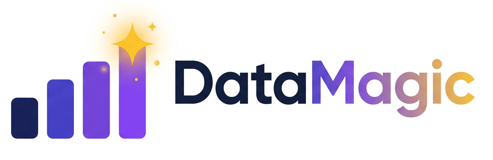
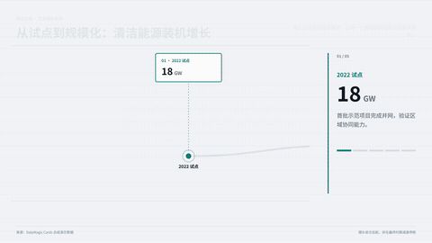
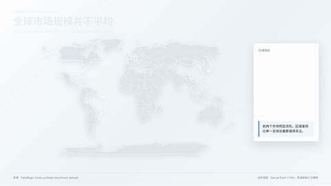

<div align="center">


**Pick an effect. Tell a story with your data.**

*A reusable recipe library for animated charts and data stories, for creators, analysts, and researchers.*

[](https://arxiv.org/abs/2609.33403)
[](https://arxiv.org/abs/2606.20388)

[中文](README.md) | [English](README.en.md)

[Watch the showcase](#showcase) · [Browse recipes](https://datamagic.chat/cards/) · [Start creating](#create) · [Build a story](#stories) · [Try online](https://datamagic.chat/) · [Research & citation](#research)
</div>

DataMagic offers **139 motion recipe cards**, each with a preview, editable source, and sample data. Choose an effect and give its implementation instructions and your data to a coding agent. The companion `datamagic` Skill guides the agent through reading the recipe, adapting the template, rendering, and checking the result.

## ✨ What's new

- **[2026.10.02]** 🎉 Released the **[DataMagic recipe library](https://datamagic.chat/cards/)**: 139 previewable, editable recipes for animated charts and data stories, with the companion **[datamagic Skill](skills/datamagic/)** to help coding agents create videos with your data.
- **[2026.08.09]** 📄 Our full paper **[DataMagic: Authoring Data Videos through Declarative Multi-Agent Orchestration](https://arxiv.org/abs/2609.33403)** has been accepted to **IEEE VIS 2026**.
- **[2026.06.20]** 🚀 **[DataMagic is live](https://datamagic.chat/)**! Turn tabular data into narrated data videos with the online system.
- **[2026.06.18]** 📄 Our paper **[DataMagic: Transforming Tabular Data into Data Insight Video](https://arxiv.org/abs/2606.20388)** has been accepted to **VLDB 2026 Demo Track**.

<a id="showcase"></a>

## 🎬 See data become a story

Character hosts, perspective boards, bar chart races, footage, timeline moves, and layered map glides: explore six approaches in the complete 30-second showcase below.

https://github.com/user-attachments/assets/6e9b939a-60e8-4e03-ae8a-b60fb23cf9c7

The reel uses actual library animations and demonstration data, with Chinese narration and captions. Each recipe below links to its implementation so you can replace the data, copy, and media.

<a id="examples"></a>

## ✨ Explore the effects

The GIFs below play automatically. Click a GIF for the high-resolution preview, or open the recipe for implementation details and source locations.

Recipes have separate Chinese and English documents. The gallery displays the document in your selected language; [English recipes](cards/recipes/en/) are also available directly. Code identifiers, parameter names and file paths remain unchanged for agent reuse.

| Character host and data board | Presenter-to-chart handoff | Countdown ranking |
|---|---|---|
| [](https://datamagic.chat/cards/#CharacterPerspectiveBoard) | [](https://datamagic.chat/cards/#PresenterDataTakeover) | [](https://datamagic.chat/cards/#RankedReveal) |
| Explain with a character, perspective board, and staged evidence. [Recipe](cards/recipes/en/CharacterPerspectiveBoard.md) | Shift attention between the presenter and the data. [Recipe](cards/recipes/en/PresenterDataTakeover.md) | Build suspense and comparison through sequential reveals. [Recipe](cards/recipes/en/RankedReveal.md) |

| Footage to evidence | Travel through a trend | Maps and regional comparison |
|---|---|---|
| [](https://datamagic.chat/cards/#FootageEvidenceReveal) | [](https://datamagic.chat/cards/#ChartTimelineTravel) | [](https://datamagic.chat/cards/#ChoroplethRankMap) |
| Establish the scene, then introduce its key metrics. [Recipe](cards/recipes/en/FootageEvidenceReveal.md) | Move along a timeline and pause at important changes. [Recipe](cards/recipes/en/ChartTimelineTravel.md) | Explain differences through geography and rankings. [Recipe](cards/recipes/en/ChoroplethRankMap.md) |

The library also covers bars, lines, shares, scatterplots, flows, openings, conclusions, and transitions, plus a [9:16 portrait ranking](cards/recipes/en/PortraitRankedReveal.md) for mobile content. Adapt the data, copy, colors, media, and timing, and keep the editable source.

**[Explore all recipes →](https://datamagic.chat/cards/)**

## 🎯 Find an approach for your story

| What you want to explain | Visual approaches | Example uses |
|---|---|---|
| A finding worth explaining | Hosts, character windows, perspective boards | Finance explainers, education, creator content |
| Who leads and what changed | Countdown rankings, bar races, rank changes | Industry rankings, competition, sports |
| Where growth comes from | Timeline moves, focus shots, contribution comparisons | Earnings, business reviews, product growth |
| How places differ | Regional maps, routes, map rankings | Cities, population, regional economies |
| What real footage reveals | Footage-to-evidence transitions, negative-space overlays | Industry, environment, documentary content |

### See it, adapt it, keep creating

- **Start with an effect you like**: browse animations or ask the agent to recommend a recipe for your data.
- **Reuse tuned motion**: adapt the matching source, including entrances, focus, highlights, and closing holds.
- **Bring your data and identity**: replace values, labels, units, titles, colors, and media; country flags, brand marks, and category illustrations follow their entities through motion, ranking changes, and reveals.
- **Build an explanation**: combine people, footage, charts, and conclusions into a sequence.
- **Keep editable output**: retain the video and source for your next topic.

<a id="create"></a>

## 🚀 Create with your content

### Watch a real reuse walkthrough

Turn a coffee-sales CSV into a bar chart race with drink icons, then change the title, highlight lattes, and extend the ending. Each drink retains its own color, and icons travel with their labels as ranks change. This 72-second walkthrough starts with the Chinese search “动态柱状图竞赛”, then follows selection, copying instructions, task input, generation, and revision. Gallery interaction is recorded; the task panel is explicitly labeled as a reconstructed workflow, not a client recording. The revised output plays in full. Narration and embedded captions are in Chinese.

https://github.com/user-attachments/assets/3309108f-97f1-4ade-a64c-a00d4d381649

[Example data, prompts and reproduction record](cards/examples/agent-workflow-demo/README.md)

### 1. Pick an effect

Watch the gallery previews and click “Copy implementation instructions.” If you are still choosing an effect, give the agent your data and intended use so it can suggest suitable recipes.

Search with Chinese or English keywords, partial names, and common aliases rather than code identifiers. Try “猫主持”, “柱状”, or “条形图竞赛”; combine terms with spaces, such as “国家 排名”.

### 2. Give the recipe and data to your agent

Clone the repository and open your coding agent in its directory:

```bash
git clone https://github.com/HKUSTDial/DataMagic.git
cd DataMagic
```

Paste the implementation instructions, attach your data, and describe the result you want:

> Use this repository's datamagic Skill to adapt RankedReveal to my sales.csv. Keep the sequential reveal, use my brand colors, and deliver an MP4 with editable source.

The companion Skill helps the agent locate source files, map data fields, adapt the visuals, and check the result. You can also start with a goal:

> I want to explain how sales changed across regions. Recommend suitable recipes for this CSV, then use the best fit to create a short video.

### 3. Review and refine

Check the values, labels, and conclusion. Ask the agent to adjust the result: “Hold the ending for two more seconds,” “Highlight the East region,” or “Adapt the layout for mobile viewing.”

[Usage and installation guide](skills/datamagic/README.md) · [Browse and render locally](cards/README.en.md)

### More ways to start

**Adapt an explainer:**

> Use CharacterPerspectiveBoard with a cat presenter on the left and the angled data board on the right. Map my data to the chart, highlight each item, and hold the conclusion. Start with the existing sample assets.

**Create for mobile:**

> Use PortraitRankedReveal to turn this ranking into a 9:16 video. Reveal entries from last to first and keep names, values, and units readable.

**Apply your identity:**

> Keep this recipe's camera motion and structure, adapt its titles, colors, and media to my brand, check the values and labels, and deliver video plus source.

<a id="stories"></a>

## 🎞️ Build a story from several shots

Open with a question, present evidence through charts, then develop the explanation through comparisons, turns, and a conclusion. **8 story blueprints** offer starting structures for the agent to select recipes and compose shots around your content.

> Use this quarterly sales table to make a 30-second story: introduce the growth, compare regional contributions, and summarize the main finding. Reuse library recipes and keep colors and captions consistent.

For deeper data analysis, scripts, and narration, follow [Plan a complete video from data](skills/datamagic/rules/full-story-workflow.md). The same Skill draws on analysis, narrative planning, and timing guidance as the task requires.

## 📦 What's in the repository

| Resource | Where to start |
|---|---|
| Animation previews, recipes, and source references | [Online gallery](https://datamagic.chat/cards/) · [Recipes](cards/recipes/) |
| Template source, sample data, and rendering | [Cards development guide](cards/README.en.md) |
| Agent usage and installation | [datamagic guide](skills/datamagic/README.md) |
| Planning and creating multi-shot stories | [Full-story workflow](skills/datamagic/rules/full-story-workflow.md) |
| Showcase videos, cover, and reproducible build script | [Showcase notes](docs/showcase.md) |
| Automatic generation examples and walkthrough | [Online system](docs/online-system.md) |

<a id="online"></a>

## 🪄 Explore further: automatic video generation

The [DataMagic online system](https://datamagic.chat/) combines table upload, data analysis, scene planning, narration, and video export. Review its recommendations and adjust the content and visuals.

Complete system examples include a story about competition in the Chinese EV market, illustrating the workflow from a table to a multi-shot video.

**[Explore the system walkthrough, generation modes, and more complete examples →](docs/online-system.md)**

<a id="research"></a>

## 📚 Research and documentation

DataMagic research studies data binding, narrative orchestration, and narration timing, informing both recipe reuse and complete video production.

- [IEEE VIS 2026: Authoring Data Videos through Declarative Multi-Agent Orchestration](https://arxiv.org/abs/2609.33403)
- [VLDB 2026 Demo: Transforming Tabular Data into Data Insight Video](https://arxiv.org/abs/2606.20388)
- [Project homepage](https://datamagic-home.github.io) · [Pipeline](docs/pipeline-overview.md) · [DVSpec](docs/dvspec-overview.md) · [Input/output examples](docs/input-output-examples.md)

### Cite DataMagic

If you find DataMagic useful in your research or work, please cite:

**IEEE VIS 2026 full paper:**

```bibtex
@misc{xie2026datamagicauthoringdata,
  title={DataMagic: Authoring Data Videos through Declarative Multi-Agent Orchestration},
  author={Yupeng Xie and Zhenyang Wang and Liangwei Wang and Jiayi Zhu and Zhouan Shen and Yuyu Luo},
  year={2026},
  eprint={2609.33403},
  archivePrefix={arXiv},
  primaryClass={cs.HC},
  url={https://arxiv.org/abs/2609.33403},
}
```

## 🗺️ What's next

- [ ] More story recipes, domain examples, and portrait layouts.
- [ ] More reuse examples across different datasets and topics.
- [ ] Multitrack workbench and Jianying delivery: simplify the workflow and complete Mac desktop validation; retained as a future TODO.

<a id="community"></a>

## 🤝 Community and contributions

Share what you create, contribute a recipe, or report an issue through [GitHub Issues](https://github.com/HKUSTDial/DataMagic/issues). [Contributing guide](CONTRIBUTING.md)


[Online system and trial credits](docs/online-system.md) · [Document history](docs/archive/README.md) · [MIT License](LICENSE) · [Security reports](SECURITY.md)
