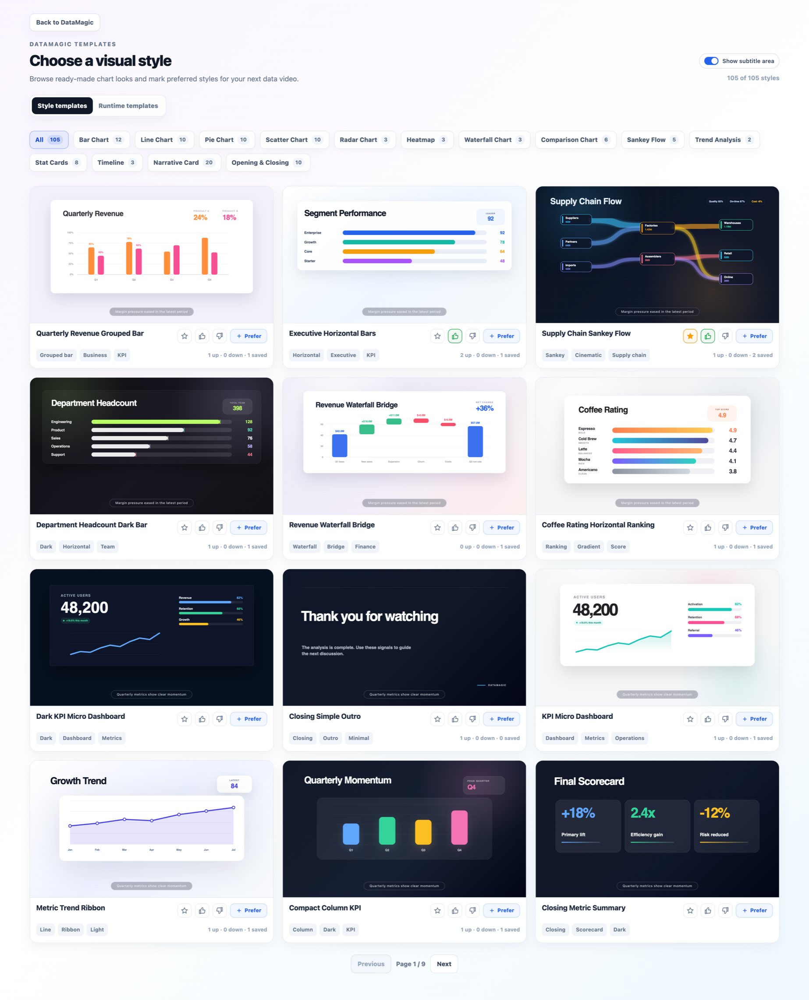
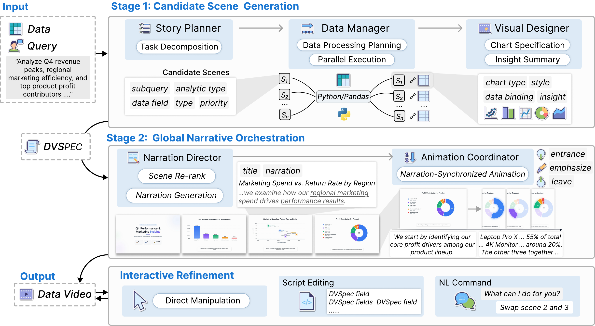

# DataMagic Online System

[中文](online-system.zh-CN.md) · [Back to DataMagic](../README.en.md)

Start with a CSV or Excel table. DataMagic helps analyze the data, plan a story, generate narration and animations, and export a complete video. Review and adjust the content at key stages to create data stories for reports, teaching, and presentations.

**[Try datamagic.chat](https://datamagic.chat/)**

## Production workflow

1. **Upload data** and the question you want to answer.
2. **Plan the content** by reviewing findings, scene order, charts, and templates.
3. **Refine the explanation** through text, narration, visual style, and emphasis.
4. **Preview and export** the finished MP4.

## Generation modes

| Mode | Approach | Typical uses |
|---|---|---|
| Full pipeline | Analyze data and plan a narrative, then generate each scene's visuals, narration, and animation | Business reports, research presentations, complete stories |
| Fast generation (Beta) | Plan content and narration, then render with pre-built templates | Recurring reports, quick production |
| Single chart (Beta) | Create an animated chart around one finding | Presentations, focused insights, social media |

Full pipeline and fast generation support a customizable workflow. Review recommendations for scenes, visuals, narrative order, and emphasis; add or remove scenes, switch templates, or adjust their order. A fully automatic workflow is also available.

## System walkthrough

<video src="https://github.com/user-attachments/assets/60bf21f9-1b04-4025-9f58-38b73818b068" width="760" controls></video>

From uploading data and planning scenes to exporting a narrated video.

## 🌟 Examples

<table>
  <tr>
    <td width="50%" align="center" valign="top">
      <video src="https://github.com/user-attachments/assets/76c81435-1ac1-49a0-b21f-413e33b57287" width="100%" controls></video>
       <strong>China consumption recovery</strong> 
      Analyzes China's retail sales and catering revenue from 2019 to 2025, showing consumption resilience and service-sector recovery after the pandemic shock.
    </td>
    <td width="50%" align="center" valign="top">
      <video src="https://github.com/user-attachments/assets/e15d0742-af24-4b30-a640-73264db91d7f" width="100%" controls></video>
       <strong>China EV market competition</strong> 
      Compares 2024 monthly sales, annual pacing, and year-over-year growth across major EV brands, highlighting market leaders and growth inflection points.
    </td>
  </tr>
  <tr>
    <td width="50%" align="center" valign="top">
      <video src="https://github.com/user-attachments/assets/4600c2ca-72fe-4690-9ad4-3a611ef2ba7e" width="100%" controls></video>
       <strong>Q4 sales analysis</strong> 
      Animated bar and trend visualization for business performance insights.
    </td>
    <td width="50%" align="center" valign="top">
      <video src="https://github.com/user-attachments/assets/1ef81518-b49d-4484-9b92-faaeff9cd188" width="100%" controls></video>
       <strong>Renewable energy transition</strong> 
      A narrated look at global renewable capacity growth from 2018 to 2024, highlighting solar expansion and the declining share of fossil fuels.
    </td>
  </tr>
  <tr>
    <td width="50%" align="center" valign="top">
      <video src="https://github.com/user-attachments/assets/ea70e828-c6fa-4913-a2e5-29799dea1d47" width="100%" controls></video>
       <strong>2024 tech revenue leaders</strong> 
      A comparison of major technology companies by 2024 revenue, showing Amazon's scale alongside Apple, Google, Nvidia, and Meta.
    </td>
    <td width="50%" align="center" valign="top">
      <video src="https://github.com/user-attachments/assets/57a347d5-8076-4662-8f27-ec4051d6e622" width="100%" controls></video>
       <strong>Tech growth and market momentum</strong> 
      An executive-style recap of 2024 tech performance, contrasting revenue scale with fast growth led by Nvidia.
    </td>
  </tr>
</table>

## Templates and editing

Preview visual styles, view community ratings, and mark preferred templates. After generation, edit text, adjust the visuals, or refine the result with natural language.

To reuse an effect in your own project, explore the [DataMagic recipe library](../cards/README.en.md) for motion previews, sample data, and editable source, then use the companion Skill to adapt it.

## Connecting data and story

**DVSpec** records scenes, data bindings, narration, and animation timing. It connects chart values and labels to source data and coordinates visual emphasis with the explanation.

[Pipeline overview](pipeline-overview.md) · [DVSpec design](dvspec-overview.md) · [Input/output examples](input-output-examples.md) · [Help center](help-center.md)

## 🔥 News

- **[2026.09.27]** 📄 Our IEEE VIS 2026 full paper is now available on [arXiv](https://arxiv.org/abs/2609.33403).
- **[2026.08.09]** 📄 Our long paper **[DataMagic: Authoring Data Videos through Declarative Multi-Agent Orchestration](https://arxiv.org/abs/2609.33403)** has been accepted to **IEEE VIS 2026**.
- **[2026.07.05]** ✨ Added a **Customizable Generation Workflow**: DataMagic surfaces recommended scene plans, visual designs, narrative ordering, and animation highlights so users can review and adjust key decisions before final rendering.
- **[2026.06.20]** 🚀 DataMagic is now live! Try it at [datamagic.chat](https://datamagic.chat/) — upload your data and generate a narrated data video in minutes.
- **[2026.06.20]** 🧩 Released the **[datamagic-video skill](../skills/datamagic-video/)** — reusable guidance that teaches AI coding agents (Claude Code, Cursor, Codex) to turn tabular data into narrated data videos.
- **[2026.06.18]** 📄 Our paper **"DataMagic: Transforming Tabular Data into Data Insight Video"** has been accepted to **VLDB 2026 Demo Track** and is now available on [arXiv](https://arxiv.org/abs/2606.20388).

## Credits for the online system

Follow either official account below and reply **DataMagic** to receive a one-time credit code (20 credits) for the hosted product.

<table>
  <tr>
    <td align="center" width="50%">
       
      <strong>DIAL 实验室</strong> 
      Research updates &amp; DataMagic news
    </td>
    <td align="center" width="50%">
       
      <strong>蟹哥聊科研</strong> 
      Research &amp; AI tool tips
    </td>
  </tr>
</table>

[Research and citation](../README.en.md#research) · [Community](../README.en.md#community) · [Back to the homepage](../README.en.md)
